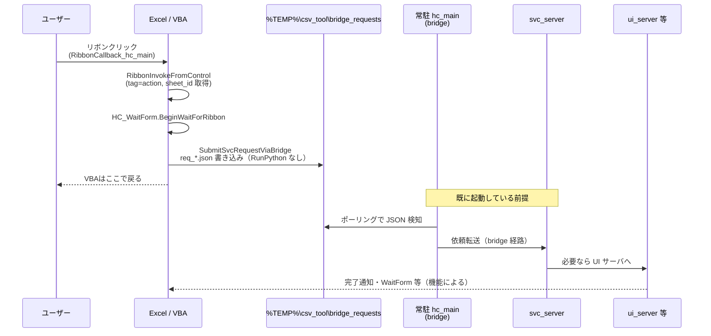
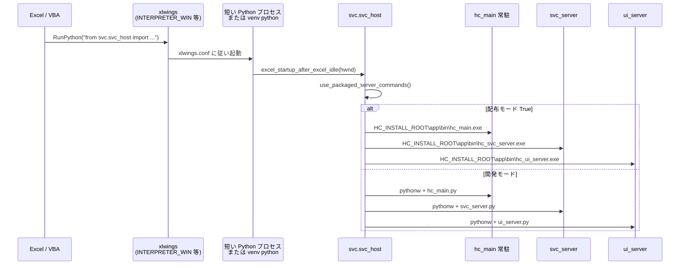

# Exe化（開発者向け）

**読者**: 開発者（Nuitka ビルド・ステージング・配布ツリーの形を決める担当）。

**ドキュメント構成**

| 文書 | 読者 | 内容 |
|------|------|------|
| **本書** | 開発者 | `hc_main` / 常駐系の **EXE 化**、ステージング `dist\CSV_Tool`、`xlwings.conf` 生成、容量・トラブルシュート |
| **`docs\インストーラ化（開発者向け）.md`** | 開発者 | Inno Setup（`CSV_Tool_Setup.exe` の **コンパイル**、`SHAREPAYLOAD` 等） |
| **`docs\インストールと運用（利用者・運用向け）.md`** | 運用・利用者 | 共有への **正本配置**、`catalog.json`、エンドユーザー手順、更新 UX |

本書は、本プロジェクト（Excel アドイン + xlwings + 常駐ブリッジ / svc / Qt UI）を **エンドユーザーに Python インストールを要求せず**配布するための EXE 化方針を整理する。実装の細部より **設計・配置・変更箇所の地図** を主とする。

---

## 1. 用語

| 用語 | 意味 |
|------|------|
| **Python なし（ユーザー視点）** | ユーザー PC に Python / venv / `pip` を用意させない。ランタイムは配布物（EXE 等）に同梱される。 |
| **Python が「なくなる」か** | ユーザーからは見えない・不要。技術的には **言語ランタイムは EXE 内に載っている**（Nuitka はコンパイルしてネイティブ実行形式にまとめる）。開発者の作業環境には Python が残る。 |
| **方式 A** | `hc_main` / `svc_server` / `ui_server`（必要なら短寿命ランナー）をそれぞれ **EXE 化**し、子プロセス起動も EXE 向けに切り替える。 |
| **方式 B** | 一部だけ EXE 化し、サーバ等は **従来どおり `pythonw.exe -u *.py`**。ユーザー環境に Python（または同梱 venv）が実質必要。 |

---

## 2. アーキテクチャ（変更の前提）

### 2.1 xlwings `RunPython`

- VBA は **`RunPython "…Python ソース1行…"`** を呼ぶ。**リボン（`RibbonCallback_hc_main`）のメイン経路では `RunPython` を使わず bridge JSON のみ**という別経路がある（**セクション 2.4**）。
- **開発モード**: `VBA\xlwings.bas` の `ExecuteWindows(False, …)` により、実際は **`python.exe -c "ブートストラップ + そのソース"`** で短寿命プロセスが起動する。ブートストラップ内で **`hc_main.py` の存在**からプロジェクトルートを決める記述がある。
- **配布モード**: `xlwings.conf` の **`USE_PACKAGED_RUNPYTHON=True`** または環境変数 **`HC_PACKAGED_DEPLOYMENT`** が真のとき、UTF-8 の一時 `.py` にブートストラップとユーザーコードを書き出し、**`INTERPRETER_WIN` で指定した短寿命 EXE**（リポジトリの `xlwings_short_runner.py` を Nuitka 化したもの等）を **`ExecuteWindows(True, …, FrozenArgs="--script-file=…")`** で起動する。インストーラは **`HC_INSTALL_ROOT`** を環境変数に設定すること。

### 2.2 常駐プロセス（`svc_host`）

- **開発時**: `svc\svc_host.py` の **`spawn_bridge` / `spawn_svc_server` / `spawn_ui_server`** は **`[pythonw.exe, "-u", スクリプトパス]`** 形式。
- **配布時**: **`HC_PACKAGED_DEPLOYMENT`** かつ **`HC_INSTALL_ROOT`** 配下に EXE がある場合、**`app\bin\`** に置いた **`hc_main.exe` / `hc_svc_server.exe` / `hc_ui_server.exe`**（同一フォルダ）を直接起動する（`core.runtime_layout`。タスクマネージャで並びやすいよう **EXE 名は `hc_` 接頭辞**）。
- 配布で **`sys.executable` が `hc_main.exe` のような単一 EXE** になった場合、**そのまま `[exe, "-u", "ui_server.py"]` では動かない**（Python インタプリタではないため）。
- 上記2変数の **意味・役割・変数名の定義場所** は **セクション 2.5** を参照。**配布PC／開発PCでの設定方法**は **セクション 2.6** を参照。

### 2.3 既存の「frozen」分岐

- `hc_main.py` 先頭: **`sys.frozen` または `globals().get("__compiled__")`** で `BASE_DIR` を `sys.executable` 側に。
- `svc_host._is_project_venv_interpreter`: `frozen` 時は venv チェックをスキップ寄り。
- `core\core_sys.py` の `get_app_path()` も **`sys.frozen` または `__main__.__compiled__`** を参照。

**注意**: Nuitka は PyInstaller と異なり、**常に `sys.frozen` が立つとは限らない**。実装では **`__compiled__`** を併用している。

### 2.4 リボン1回押下時の呼び出し順（現行 `VBA\Main.bas`）

リボン（`customUI` → `Main.RibbonCallback_hc_main`）の **メイン経路**では、**そのクリック1回あたり `xlwings.RunPython` は呼ばれない**（`Main.RibbonInvokeFromControl` → `SubmitSvcRequestViaBridge`）。依頼は **`%TEMP%\csv_tool\bridge_requests\`** に UTF-8 の **`req_*.json`** として書き出され、**既に起動している常駐 `hc_main`（bridge）** がポーリングで拾い **`svc_server` へ転送**する二段構えである（2.5.0 以降の方針。コメントは `VBA\Main.bas` 冒頭参照）。

したがって **`HC_INSTALL_ROOT` / `HC_PACKAGED_DEPLOYMENT` は「リボン1クリックごと」には効かない**。これらは **`svc.svc_host` が常駐プロセスを spawn するとき**（後述の起動時 `RunPython` 経由）に参照される。

#### 図1: リボンを1回押したとき（メイン経路）



#### 図2: いつ初めて `RunPython` が動き、環境変数が効くか

常駐の **bridge / svc_server / ui_server** を立てるのは、起動シーケンス側の **`RunPython`**（例: `Main.InitPythonServer` の `from svc.svc_host import excel_startup_after_excel_idle; ...`、または `Workbook_Open` 系で先に走る `startup_full` 等。詳細は `VBA\ThisWorkbook.cls` / `Main.bas`）である。ここで一度 **`svc_host`** が動き、**`use_packaged_server_commands()`**（`HC_PACKAGED_DEPLOYMENT` + `HC_INSTALL_ROOT` + `app\bin\hc_main.exe` の実在）に応じて **EXE 起動**か **`pythonw` + `.py`** かが決まる（**セクション 2.2**）。



#### 補足: `RunPythonSafe` 経路

`Main.RunPythonSafe` は **`RunPython` → `core.excel_session.invoke_action` → `hc_main.invoke`** の短い Python を起動する別経路（非リボン・レガシー用途など）として残る。メインのリボン処理は **図1** が正である。

### 2.5 環境変数 `HC_INSTALL_ROOT` / `HC_PACKAGED_DEPLOYMENT`（意味・役割・名前の出所）

Windows や xlwings が予約している名前ではなく、**本プロジェクトの実装で採用した OS 環境変数名**である。値は **インストーラ・ユーザー環境変数・起動バッチ・（将来案）VBA での `SetEnvironmentVariable` 等**から Excel プロセスに渡される。

#### それぞれの意味と役割

| 変数名 | 意味 | 主な役割 |
|--------|------|----------|
| **`HC_INSTALL_ROOT`** | 配布ツリー（例: `CSV_Tool`）の **ルートディレクトリ**のパス | `core.runtime_layout.install_root()` が読み取り、その下の **固定レイアウト**（例: `app\bin\hc_main.exe`）を組み立てる。`packaged_app_exe()`、`runtime_project_root()`。短寿命 **`xlwings_short_runner.py`** は `os.environ.get("HC_INSTALL_ROOT")` で参照。`VBA\xlwings.bas` の packaged RunPython 経路でも `Environ$("HC_INSTALL_ROOT")` を参照。 |
| **`HC_PACKAGED_DEPLOYMENT`** | **配布（EXE 前提）モード**であることの宣言（`1` / `true` / `yes` 等を truthy とみなす） | `packaged_spawn_requested()` が参照。`VBA\xlwings.bas` でも xlwings の packaged 分岐に使用。**単体では不十分**: 常駐を EXE で起動するかは `use_packaged_server_commands()` が **`HC_PACKAGED_DEPLOYMENT` が真**かつ **`HC_INSTALL_ROOT` が有効なディレクトリ**かつ **`%HC_INSTALL_ROOT%\app\bin\hc_main.exe` が存在**するかまで含めて判定する（下記コード参照）。 |

**端的に**: **`HC_INSTALL_ROOT` = 配布物がどこにあるか**、**`HC_PACKAGED_DEPLOYMENT` = 配布モードとして扱うか**。**常駐 bridge / svc / ui を EXE にするか**は主にこの2つ＋**ブリッジ EXE の実在**で決まる（**セクション 2.2**）。**短い `RunPython` がどのインタプリタで動くか**は **`xlwings.conf` の `INTERPRETER_WIN` 等**であり、環境変数とは別レイヤー（**セクション 2.1**）。

`use_packaged_server_commands()` の判定（抜粋）:

```32:40:core/runtime_layout.py
def use_packaged_server_commands() -> bool:
    """True when packaged mode is on and bridge EXE exists under app\\bin\\."""
    if not packaged_spawn_requested():
        return False
    root = install_root()
    if root is None:
        return False
    exe = root / "app" / "bin" / "hc_main.exe"
    return exe.is_file()
```

#### 変数名はどこで決まっているか

**正規の定義元（Python）**は `core/runtime_layout.py` の定数である。

```11:12:core/runtime_layout.py
ENV_INSTALL_ROOT = "HC_INSTALL_ROOT"
ENV_PACKAGED = "HC_PACKAGED_DEPLOYMENT"
```

同じ綴りが **`VBA\xlwings.bas`**（`Environ$("HC_INSTALL_ROOT")` 等）、**`xlwings_short_runner.py`**、**`tools\apply_xlwings_packaged_vba.py`** などに **文字列リテラルとして重複**している。名前を変更する場合は **これらを一括で揃え替える**必要がある。詳細一覧は **`docs\environment_variables.md`** の該当節も参照する。

### 2.6 開発PC／配布PCの環境変数運用（方針）

本プロジェクトでは次の方針とする。

| 対象 | 環境変数（`HC_INSTALL_ROOT` / `HC_PACKAGED_DEPLOYMENT` 等）の扱い |
|------|------------------------------------------------------------------|
| **配布PC（エンドユーザー）** | **インストーラ**（Inno Setup / MSI 等）が **ユーザーまたはマシン環境**に設定する。手順の例は **`docs\インストールと運用（利用者・運用向け）.md`** および **`docs\environment_variables.md`** を参照。 |
| **開発PC** | **`tools\dev\` のバッチで `HC_*` をセットまたはクリア**する（**その cmd ウィンドウにだけ**有効。**ユーザーの永続環境変数を毎回いじらない**運用を推奨）。**Excel はバッチでは起動しない** — 同じ cmd で環境を整えたあと、スタートメニュー等から Excel を起動する。引数なしの **`start_excel.bat`** で **メニュー**（配布／開発）に切り替え可能。 |

#### 開発PC用バッチ（`tools\dev\`）

| ファイル | 用途 |
|----------|------|
| **`tools\dev\start_excel.bat`** | **引数なし**で **対話メニュー**（**`1`**＝配布、**`2`**＝開発）。**Excel は起動しない**。**`HC_*` のみ**現在の cmd に反映。配布は既定 **`C:\Program Files\Excel_Addin\CSV_Tool`**。**`start_excel 1`** / **`start_excel 2`** でもメニューなし（**`start_excel 1 "別パス"`** でルート上書き）。**`start_excel packaged`** / **`start_excel dev`** も可。 |
| **`tools\dev\start_excel_dev.bat`** | リポジトリルートへ **`cd`** し、**`HC_INSTALL_ROOT` / `HC_PACKAGED_DEPLOYMENT` をクリア**する（**`setlocal` なし**のため **同じ cmd で `set HC` すると空**になる）。**Excel は起動しない** — 続けて手動で Excel を起動する。常駐は **`pythonw` + `.py`** 分岐になりやすい（**セクション 2.2**）。 |
| **`tools\dev\start_excel_packaged_test.bat`** | **`HC_PACKAGED_DEPLOYMENT=1`** と **`HC_INSTALL_ROOT`** をセットする。**Excel は起動しない**。**第1引数省略時**の既定は **`C:\Program Files\Excel_Addin\CSV_Tool`**。**`dist\CSV_Tool`** で試すときは第1引数で渡すか、**`CSV_TOOL_PACKAGED_ROOT`** で上書き。`app\bin\hc_main.exe` が無い場合はエラー終了。 |

#### CMD と PowerShell

- これらは **`.bat`（cmd バッチ）** である。**実体の解釈は `cmd.exe`**。**推奨はコマンドプロンプト（cmd）** から実行する。
- **PowerShell** から **`.\tools\dev\start_excel_dev.bat`** のように呼んでもよい（多くの場合、**cmd が起動してバッチが実行**される）。**`set HC_*=...` は cmd の構文**のため、PowerShell で直接 **`$env:HC_*`** を触る場合は **別プロセス**になる点に注意する。

使用例（**cmd**）。**バッチは内部でリポジトリルートへ `cd` する**ため、**カレントは任意**でもよいが、**相対パスで呼ぶときは分かりやすさのためルートで実行**する例を示す。

```bat
tools\dev\start_excel.bat
tools\dev\start_excel_dev.bat
tools\dev\start_excel_packaged_test.bat
tools\dev\start_excel_packaged_test.bat "C:\Temp\ManualCSVTool"
```

**PowerShell**（**推奨は cmd**；PowerShell から呼ぶ場合の例）:

```powershell
.\tools\dev\start_excel.bat
.\tools\dev\start_excel_dev.bat
.\tools\dev\start_excel_packaged_test.bat
.\tools\dev\start_excel_packaged_test.bat "C:\Temp\ManualCSVTool"
```

**別フォルダ**へコピーして試す場合は、**`start_excel_packaged_test.bat` の第1引数**に **書き込み可能な絶対パス**を渡すか、**`start_excel packaged "C:\Temp\ManualCSVTool"`** とする。ドキュメントに出てくる **`D:\...` は単なる例示**であり、**D ドライブは不要**。

上記バッチは **Excel を起動しない**。**同じ cmd で `HC_*` を整えたあと**、スタートメニューまたはショートカットから Excel を起動する。

**注意**:

- 既に起動済みの Excel には環境が反映されない。**切り替えたいときは Excel を終了してから**、目的のバッチで **`HC_*` をセット／クリア**し、**続けて同じ CMD から Excel を起動**し直す。
- 短い **`RunPython` が使うインタプリタ**は **`xlwings.conf` の `INTERPRETER_WIN` 等**であり、本バッチは主に **常駐 spawn（`svc_host`）** 側の切り替えに効く（**セクション 2.1**）。

#### 設定が効いているかの確認

- **バッチの echo**（`start_excel_packaged_test.bat` は `HC_*` の実値、`start_excel_dev.bat` はクリアの説明）がいちばん手軽。
- **PowerShell** で **`Get-ChildItem Env: | Where-Object { $_.Name -like 'HC_*' }`** や **`$env:HC_INSTALL_ROOT`** は **「今の PowerShell プロセス」**の環境のみ。バッチを **PowerShell から `.\...bat` で起動した場合**、**子の cmd** に値が入り **親の `$env:` には自動では乗らない**。**確認はバッチの echo**、**`cmd /k`** で残したウィンドウの **`set HC`**、または **Excel をその cmd から起動したうえで VBA `Environ`** が確実である。

### 2.7 開発PCでインストーラなし手動配布ツリーを作り EXE を確認する（ステップ）

**目的**: 配布PCにインストーラを回さず、**手動でセクション 5 と同型のフォルダ**を作り、Nuitka 成果物で **常駐 EXE 経路**を試す。

#### 手順（ステップバイステップ）

1. **ビルド** … `tools\nuitka\build_nuitka_all.bat`（または個別の `build_nuitka_*.bat`）を実行する。既定では **`dist\CSV_Tool\`** 配下に **セクション 5 と同型**のツリーができる（**`app\bin`** に EXE・DLL 等が **フラット**。**セクション 3.5.1**）。一括ビルド後は **`config\`** の同期と **`xlwings.conf` のステージング生成**まで自動（`assemble_csv_tool_staging.bat`）。
2. **インストールルートを決める** … 書き込み可能なパスに空フォルダを作る（例: `C:\Temp\ManualCSVTool`。**ドライブ・フォルダ名は任意**。昔のドキュメント例の **`D:\...` は単なる例**）。以降これを **インストールルート**と呼ぶ。`Program Files` 下でなくてよい（権限・AV の観点で推奨）。
3. **`app\bin` を作る** … `インストールルート\app\bin\` に **`hc_main.exe` / `hc_svc_server.exe` / `hc_ui_server.exe` / `hc_xlwings_short_runner.exe`** と Nuitka 同梱物を置く（**手元の `dist\CSV_Tool\` をそのまま丸ごとコピー**してもよい）。
4. **ルートの `config\` と `xlwings.conf`** … **`dist\CSV_Tool\config\`** と **`dist\CSV_Tool\xlwings.conf`** を **インストールルート**へコピーする（または **`dist\CSV_Tool\` を丸ごと**コピーし **`addin\` だけ**後から足す）。**バッチ既定**では Nuitka の **`*.dist` は `app\_stage_*` 直下へフラット展開のうえ `app\bin` へマージ済み**（**`nuitka_flatten_dist_into_parent.bat`**・**`merge_nuitka_stage_into_bin.bat`**）。**`xlwings.conf`** はステージング生成時に **短寿命 EXE＝リポジトリ上の `dist\CSV_Tool\...` 絶対パス**が入る。**コピー先が別パス**なら **`INTERPRETER_WIN` / `INTERPRETER`** を **`インストールルート\app\bin\hc_xlwings_short_runner.exe`** に直す。**`USE_PACKAGED_RUNPYTHON = True`** で配布試験（**セクション 7.1**）。**短い `RunPython` だけ venv** にする場合は開発用 `xlwings.conf` 流用で **混在モード**。
5. **`addin` と xlam** … `インストールルート\addin\` を作り、検証用の **`CSV_Tool.xlam`（または開発中の xlam）** を置く。Excel の **アドイン**からそのファイルを読み込む（信頼の場所の都合に注意）。
6. **環境変数をセット** … **`tools\dev\start_excel.bat`**（メニュー）または **`tools\dev\start_excel_packaged_test.bat`**（**引数省略可**＝既定 **`C:\Program Files\Excel_Addin\CSV_Tool`**。ステージングだけ試すなら **`"dist\CSV_Tool"`** を第1引数に、または **`CSV_TOOL_PACKAGED_ROOT`**）で **`HC_*` を現在の cmd にセット**する。**続けて手動で Excel を起動**する。**既存の Excel を終了してから**切り替えると確実。
7. **動作確認** … リボン操作、`%TEMP%\csv_tool\` のログ、**`app\bin`** 配下の各 EXE のブートログ（**`docs\environment_variables.md`**）を確認する（**セクション 10** 近傍）。

#### コピー量（数百 MB×複数）について

- Nuitka **`--standalone`** の各 `*.dist` は **EXE と依存 DLL／`.pyd`／データが一体**になっている。**EXE だけ**を抜き出してコピーしても **ほぼ確実に起動しない**。
- **バイナリ同梱（pandas / Qt 等）が容量の主因**であり、JSON の **`config\` は各ツリーに比べて小さい**。
- **`app\bin` に Nuitka 同梱一式が集まるためツリーは太い**。**同じマシン上で検証だけ**なら、**`dist\CSV_Tool`** を **`start_excel_packaged_test.bat` の第1引数**に渡すか **`set CSV_TOOL_PACKAGED_ROOT=dist\CSV_Tool`** を付けてから引数なしで実行する（**引数なしの既定**は `Program Files` 下のインストール先）。**junction** で **`dist\CSV_Tool\app`** を別ドライブに向ける場合は **`dist\CSV_Tool\app\bin`** が実体として見えるパスを指す。**本番配布では通常フルコピー**とする。

#### インストールルートの `config\`（セクション 5）と各 `app\...\config\`

**現行実装**（`core_cst.resolve_config_file_path`）の解決順は次のとおりである。

1. **`HC_INSTALL_ROOT` が有効**で、**`<インストールルート>\config\<ファイル名>` が存在する** → **そのパス**（配布では **`\CSV_Tool\config\ui_*.json` 等の単一正本**。**`assemble_csv_tool_staging.bat`** の **`robocopy`** でステージング／インストール先に作る）。
2. 上記以外 → **`core_cst.py` の親の親**（**開発時はリポジトリルート**）の **`config\<ファイル名>`**。Nuitka ビルドでは **`--include-data-dir=config=config` を付けず**、各 `app\...\config\` は作らない（二重管理を避ける）。**配布の凍結 EXE では 1 を必ず満たすこと**。

`get_ui_config_from_file_required` および **`svc_warmup.json`** を読む **`svc_server._get_warmup_actions`**、**`ui_data_agg_debug`** の直接読込は、いずれも **`resolve_config_file_path`** 経由に統一されている。

**運用上のおすすめ**:

- **配布**: インストーラまたは **`assemble`** が **`HC_INSTALL_ROOT\config\`**（ステージングなら **`dist\CSV_Tool\config\`**）にリポジトリの `config\*.json` を置く。**各 `app\...\config\` は Nuitka で作らない**（単一正本のみ）。
- **開発**（venv、`HC_INSTALL_ROOT` 未設定）: 従来どおり **リポジトリルートの `config\`**（例: `\EXCEL_ADDIN\config\`）が使われる。

**ビルドバッチ**: 各 `build_nuitka_*.bat` では **`--include-data-dir=config=config` を付けない**。**ルートの `\CSV_Tool\config\`** は **`assemble_csv_tool_staging.bat`** の **`robocopy`** のみ。**配布では必ず** `HC_INSTALL_ROOT\config\` を揃えること。

#### 「必要最低限」はあるか

| 観点 | 内容 |
|------|------|
| **1 つの `*.dist` の内部** | **原則すべて必要**（任意にファイルを削らない）。 |
| **4 モジュールすべて** | **本番相当のリボン〜svc〜UI まで試すなら** **`hc_main.exe` / `hc_svc_server.exe` / `hc_ui_server.exe`** の **3 本＋依存 DLL が `app\bin` に揃っていること**が必要（起動時に `svc_host` が順に spawn するため）。**短寿命ランナー**は **`hc_xlwings_short_runner.exe` も同じ `app\bin`** に置き、`xlwings.conf` でそのパスを指す。 |
| **ディスク節約** | 本番では **インストーラ1回**でローカルに展開するだけ。開発検証で繰り返しコピーする場合は **junction** や **別ドライブ上の同一ツリーへのショートカット起動**などを検討する（運用責任は利用者側）。**Nuitka の `--report`** で不要モジュールを削る最適化は別途検証が要る（**セクション 3.4.2**）。 |

---

## 3. Nuitka ビルド環境とコマンド

### 3.1 前提（環境）

- **Python**: 本プロジェクトは 3.12+ 想定。ビルド用も合わせるのが安全。
- **Nuitka**: venv に `pip install nuitka`。
- **Windows コンパイラ**: Visual Studio Build Tools の **「C++ によるデスクトップ開発」**（MSVC + Windows SDK）。「x64/x86 用 MSVC ビルドツール（最新）」と「MSVC v143 - VS 2022 …」は **どちらかで可**（二重必須ではない）。
- **作業ディレクトリ**: リポジトリ**ルート**（`hc_main.py` があるディレクトリ）。以下の PowerShell 例はその前提。

### 3.2 実施済み（ソース・設計）

| 区分 | 内容 |
|------|------|
| レイアウト | `core/runtime_layout.py` … `HC_INSTALL_ROOT` / `HC_PACKAGED_DEPLOYMENT`、`packaged_app_exe`、`use_packaged_server_commands` |
| 子プロセス | `svc/svc_host.py` … `spawn_bridge` / `spawn_svc_server` / `spawn_ui_server` の packaged 時 EXE 起動 |
| パス・互換 | `hc_main.py` … `sys.frozen` と `__compiled__`。`core/core_sys.py` … `get_app_path()` で `__main__.__compiled__` |
| xlwings | `VBA/xlwings.bas` … `USE_PACKAGED_RUNPYTHON` / `HC_PACKAGED_DEPLOYMENT` 時の UTF-8 一時ファイルと `--script-file` 経路 |
| 短寿命 | `xlwings_short_runner.py`（ルート） |
| 設定例 | `xlwings.conf` … packaged 用コメント |
| 環境変数説明 | `docs/environment_variables.md` … `HC_INSTALL_ROOT` / `HC_PACKAGED_DEPLOYMENT` |
| 開発PCの `HC_*` 切替 | `tools/dev/start_excel.bat` / `start_excel_dev.bat` / `start_excel_packaged_test.bat`（**セクション 2.6**） |

### 3.3 これから実施（ビルド・配布・検証）

| 区分 | 内容 |
|------|------|
| ビルド | 下記 **3.5** の PowerShell で各 EXE を生成（初回は依存のダウンロード・コンパイルに時間がかかる） |
| 配置 | 既定のステージング **`dist\CSV_Tool\`**（**セクション 3.5.1**）を **Inno Setup の `Files` ソース**にするか、インストールツリーへ **丸ごとコピー**する |
| 環境 | インストーラまたは手動で `HC_INSTALL_ROOT`・`HC_PACKAGED_DEPLOYMENT`、必要なら `xlwings.conf` の `USE_PACKAGED_RUNPYTHON` と `INTERPRETER_WIN`（短寿命 EXE のフルパス） |
| VBA | リポジトリの `VBA\xlwings.bas` を xlam に取り込み済みか確認 |
| 検証 | 開発（従来の venv）と配布モードの両方で起動・リボン・RunPython を確認 |
| 調整 | 取りこぼしモジュールがあれば `--include-package=...` の追加や `--report=...` で確認 |

### 3.4 主要 Nuitka オプション（本プロジェクト向け）

| オプション | 意味 |
|------------|------|
| `--standalone` | ランタイムを同梱した配布用ビルド |
| `--assume-yes-for-downloads` | 初回のコンパイラ等のダウンロードを確認なしで許可（非対話向け） |
| `--output-dir=...` | 出力先。本プロジェクトでは **`app\_stage_*`** にビルドし **`merge_nuitka_stage_into_bin.bat`** で **`app\bin`** に集約する（並列ビルド時は **別 `_stage_*`** で衝突を避ける） |
| `--remove-output` | **EXE 等の生成が完了したあと**に **`*.build`**（C コンパイル等の中間ディレクトリ）を削除する（Nuitka `--help` の説明どおり。**ビルド開始前に `output-dir` を空にする**意味ではない）。本プロジェクトの `build_nuitka_*.bat` では付与済みのため、**正常完了後は `*.build` が見えない**ことが普通。付けないと `*.build` が残る。失敗・中断時は `*.build` が残っていることがある |
| `--windows-console-mode=disable` | コンソールウィンドウを表示しない（常駐プロセス・GUI 向け）。**旧 `--windows-disable-console` は非推奨**（Nuitka が警告を出す） |
| `--jobs=N` | バックエンド C コンパイル等の並列数（CPU に合わせる。**バッチでは環境変数 `NUITKA_JOBS` で指定、未設定時は 4**） |
| `--disable-plugin=delvewheel` | **必要時のみ**。`delvewheel` プラグインが特定環境で失敗する場合の回避（通常は不要） |
| `--enable-plugin=multiprocessing` | `svc_server` が `multiprocessing` を使うため推奨 |
| `--enable-plugin=pyside6` | `ui_server`（PySide6）向け |
| `--include-package=core` | 共有パッケージ `core` を明示同梱（取りこぼし対策） |
| `--include-package=svc` | `svc_server` の動的 import の取りこぼし対策 |
| `--include-package=ui_qt` | `ui_server` 用パッケージの同梱 |
| `--output-filename=hc_….exe` | 成果物 EXE のファイル名。**`hc_main.exe` / `hc_svc_server.exe` / `hc_ui_server.exe` / `hc_xlwings_short_runner.exe`** のように **`hc_` 接頭辞**にすると、タスクマネージャで **名前が固まって確認しやすい**（本プロジェクトの `build_nuitka_*.bat` 既定） |
| `--show-progress` | ビルド進行の表示 |
| `--report=path.html` | 取りこぼし調査用 HTML レポート |

### 3.4.1 `config\` の単一経路（`assemble` のみ）

| 経路 | 何が起きるか | 配布での意味 |
|------|----------------|--------------|
| **`assemble_csv_tool_staging.bat`** | **`robocopy`** でリポジトリ **`config\` → `%CSV_TOOL_STAGING%\config\`**（例: **`dist\CSV_Tool\config\`**） | **インストールルート直下の `config\`** と同型。**`HC_INSTALL_ROOT\config\`** が **`resolve_config_file_path`** の **第1候補**（**単一正本**）。Nuitka では **`--include-data-dir=config=config` を付けず**、各 **`app\...\config\`** は作らない（**セクション 2.7**） |

**まとめ**: **ルートの `\CSV_Tool\config\`** は **`assemble_csv_tool_staging.bat`（またはインストーラの `Files`）** で **のみ**作る。各 EXE バンドル内に **`config\` の二重コピーはしない**。

**ビルド環境の注意（scipy）**

- `pip` では **scipy が入っていない**のに `.venv\Lib\site-packages\scipy` に **壊れた残骸**（例: `scipy._lib` が無い）だけが残っていると、Nuitka が `scipy` を解析する段階で **`delvewheel` / `implicit-imports` プラグインがクラッシュ**することがある。
- 対処: **残骸フォルダ `scipy` を削除**するか、プロキシ等を通して **`pip install scipy`** で正常インストールし直す（ネットワーク可の環境で）。

### 3.4.2 未使用ライブラリの扱い（同梱範囲の考え方）

**「使っていないライブラリはビルドしない」専用の単一オプションはない。** Nuitka は **エントリスクリプトから静的に辿れる import グラフ**を基準に、必要と判断したモジュールをコンパイル・同梱する（`--standalone` ではその範囲が配布物の中心になる）。

| 観点 | 内容 |
|------|------|
| **グラフに乗らないモジュール** | 原則として **同梱されない**（site-packages 全体を無差別に入れるわけではない）。 |
| **一度グラフに乗った大きなパッケージ** | 例: **`pandas`** は内部サブモジュールまで広く含まれることが多く、**アプリで実際に使う部分だけを機械的に削るツリーシェイク**は、デフォルトだけでは限定的である。 |
| **省きたい／追跡を止めたい** | 例: **`--nofollow-import-to=パッケージ`**（**動的 import や実行パスを壊し得る**ので検証必須）、**Anti-Bloat** 等の標準プラグイン（特定パッケージ向けのヒューリスティック・万能ではない）、**`--noinclude-*` 系**（DLL・データ同梱の調整。ライブラリ全体の「ビルドしない」とは別レイヤー）。詳細は **`python -m nuitka --help`** および Nuitka 公式ドキュメントを参照。 |

**本プロジェクトのバッチおよび本書セクション 3.5 の例**

- **`--nofollow-import-to` や Anti-Bloat を明示して適用していない**（未使用を積極的に除外する設定は入れていない）。
- 逆に **`--include-package=...`** は **取りこぼし防止・安全側**のため **同梱を増やす**方向である（**`config\` は同梱しない**。**セクション 2.7**）。

**成果物を小さくしたい場合の方針（参考）**

- **venv から不要な依存を外す**（そもそもグラフに乗らないようにする）。
- **import 経路を整理**する（重いオプション依存を遅延 import にし、エントリからの静的辿りを減らす等。設計変更が伴う）。
- 必要なら **`--nofollow-import-to` 等を試し、必ず実行テストと `--report`** で確認する。

### 3.5 ビルドコマンド（PowerShell）

#### 実行ディレクトリ（カレントフォルダ）

| 実行方法 | カレントにすべき場所 | 補足 |
|----------|----------------------|------|
| **下記の `python -m nuitka ...` をそのまま叩く** | **リポジトリルート**（`hc_main.py` と同じフォルダ） | `hc_main.py`・`svc\...`・`--output-filename=hc_….exe` など **相対パスはすべてここを基準**に解決される。 |
| **`tools\nuitka\build_nuitka_*.bat` を使う** | **どこでも可** | バッチが内部でリポジトリルート（バッチから見て `..\..`）へ `cd` する。フルパスで呼んでもよい（例: `C:\Project\Python\Excel_AddIn\tools\nuitka\build_nuitka_bridge.bat`）。 |

#### 使用する Python（手動コマンドのとき）

- **推奨**: リポジトリルートで **`.venv\Scripts\python.exe`** をフル指定する。  
  例: `.\.venv\Scripts\python.exe -m nuitka ...`（PowerShell） / `".venv\Scripts\python.exe" -m nuitka ...`（cmd）。  
- または **venv をアクティベート**したうえで `python -m nuitka ...`。  
- **注意**: PATH 上の別の `python.exe`（ユーザー領域・別プロジェクト）だと、**Nuitka 未導入・依存バージョン不一致**で失敗しやすい。

#### 環境変数（主に並列数）

| 変数名 | 必須 | 意味 |
|--------|------|------|
| **`NUITKA_JOBS`** | いいえ | Nuitka の **`--jobs`** に渡す正の整数。**未設定時はバッチでは `4`**。手動コマンドでは `--jobs=4` をそのまま書いているので、変えたいときは **コマンド上の数値を変更**するか、バッチ経由で `NUITKA_JOBS` を設定する。 |

※ その他（`HTTP_PROXY` 等）は OS・社内ポリシーに従う。Nuitka 本体のオプション一覧は `python -m nuitka --help` を参照。

---

行末の **バッククォート**（`` ` ``）は PowerShell の行の継続です。**バッククォートの直後にスペースを入れない**こと。

**手動実行の手順（PowerShell の例）**

1. `Set-Location` で **リポジトリルート**へ移動する（例: `Set-Location "C:\Project\Python\Excel_AddIn"`）。
2. 各コードブロックの先頭行 `python -m nuitka` を、**`.\.venv\Scripts\python.exe -m nuitka`** に読み替えて実行する（venv を有効化済みなら `python` のままでもよい）。

**ブリッジ（`hc_main.exe`）**

```powershell
python -m nuitka `
  hc_main.py `
  --standalone `
  --assume-yes-for-downloads `
  --windows-console-mode=disable `
  --msvc=latest `
  --output-dir=dist\CSV_Tool\app\_stage_bridge `
  --output-filename=hc_main.exe `
  --remove-output `
  --include-package=core `
  --show-progress `
  --jobs=4
```

**svc（`hc_svc_server.exe`）**

```powershell
python -m nuitka `
  svc\svc_server.py `
  --standalone `
  --assume-yes-for-downloads `
  --windows-console-mode=disable `
  --msvc=latest `
  --output-dir=dist\CSV_Tool\app\_stage_svc_server `
  --output-filename=hc_svc_server.exe `
  --remove-output `
  --enable-plugin=multiprocessing `
  --include-package=svc `
  --include-package=core `
  --show-progress `
  --jobs=4
```

**UI（`hc_ui_server.exe`）**

```powershell
python -m nuitka `
  ui_qt\ui_server.py `
  --standalone `
  --assume-yes-for-downloads `
  --windows-console-mode=disable `
  --msvc=latest `
  --output-dir=dist\CSV_Tool\app\_stage_ui_server `
  --output-filename=hc_ui_server.exe `
  --remove-output `
  --enable-plugin=pyside6 `
  --include-package=ui_qt `
  --include-package=core `
  --nofollow-import-to=polars,pandas,numpy,scipy `
  --noinclude-qt-translations `
  --noinclude-qt-plugins=mediaservice `
  --noinclude-qt-plugins=printsupport `
  --noinclude-qt-plugins=iconengines `
  --noinclude-dlls=*.pdb `
  --show-progress `
  --jobs=4
```

（上記の Qt プラグイン省略は **`build_nuitka_ui_server.bat`** と同じ。**`printsupport`** は印刷ダイアログ／`QPrinter` 系。**`mediaservice`** は **Qt Multimedia**（動画・音声の再生など）用バックエンドであり、**アイコン用の PNG／SVG 表示とは無関係**。**`iconengines`** は **テーマ用 SVG アイコン**（`qsvgicon`）。**`--nofollow-import-to`** は **UI プロセスに polars／pandas／numpy／scipy を同梱しない**（数値処理は **svc_server** 側）。`QMediaPlayer` や印刷・テーマ SVG が必要なら該当オプションを外す。ステージング後 **`trim_staging_ui_qt_optional.ps1`** で **WebP／TIFF 等の画像コーデック DLL** を削除する（**セクション 11**）。）

**短寿命 xlwings（`hc_xlwings_short_runner.exe`）**

```powershell
python -m nuitka `
  xlwings_short_runner.py `
  --standalone `
  --assume-yes-for-downloads `
  --windows-console-mode=disable `
  --msvc=latest `
  --output-dir=dist\CSV_Tool\app\_stage_xlwings_short_runner `
  --output-filename=hc_xlwings_short_runner.exe `
  --remove-output `
  --include-package=core `
  --include-package=svc `
  --show-progress `
  --jobs=4
```

本プロジェクトでは **安全側**（`exec` される `RunPython` 用スクリプトが `core` / `svc` を import し得るのに、エントリ `xlwings_short_runner.py` だけでは Nuitka が静的に検出しないため）として、短寿命ビルドに **`--include-package=core`**・**`--include-package=svc`** を **既定で付与**する。**`config\` JSON は Nuitka に同梱せず**、**`assemble_csv_tool_staging.bat`** で **ステージング／インストールルートの `config\` のみ**とする（**セクション 2.7**）。成果物サイズ・ビルド時間は増えるが、インストール先にソースツリーを置かない配布でも取りこぼしにくい。**極小化したい場合のみ**、配布構成と実行試験のうえで同梱パッケージを削る。

**手動で `python -m nuitka` した場合** … バッチと同じステージングに揃えるには、各 `output-dir` ごとに **`tools\nuitka\nuitka_flatten_dist_into_parent.bat`** を実行し、最後に **`assemble_csv_tool_staging.bat`** で **`config\`・`xlwings.conf`** を補う。

**`--jobs=4`** … 並列コンパイルの目安。マシンに合わせて増減するか、下記バッチの **`NUITKA_JOBS`** で上書きする。

### 3.5.1 バッチファイル（`tools\nuitka\`）

コマンドプロンプトまたは PowerShell から、**リポジトリルートをカレントにしなくても**同じ Nuitka 引数でビルドできるよう、次を置く。

**ステージングルート（既定 `dist\CSV_Tool`）** … 各ビルドの **`--output-dir`** は **`%CSV_TOOL_STAGING%\app\_stage_bridge`** 等の一時ディレクトリ（**`CSV_TOOL_STAGING` 未設定時は `dist\CSV_Tool`**）。**セクション 5** の **`app\bin`** に **`merge_nuitka_stage_into_bin.bat`** で集約する。ビルド成功後、各バッチは **`nuitka_flatten_dist_into_parent.bat`** で **`*.dist` 内の EXE・DLL 等をステージ直下へフラット展開**し、続けて **`app\bin`** へマージする。

| ファイル | 内容 |
|----------|------|
| `tools\nuitka\build_nuitka_bridge.bat` | `hc_main` → **`%CSV_TOOL_STAGING%\app\_stage_bridge`** → フラット化 → **`merge_nuitka_stage_into_bin.bat`** |
| `tools\nuitka\build_nuitka_svc_server.bat` | 同上 … `_stage_svc_server` |
| `tools\nuitka\build_nuitka_ui_server.bat` | 同上 … `_stage_ui_server`（**`--noinclude-qt-translations`** 等で Qt 同梱を抑える。**REM** 参照） |
| `tools\nuitka\build_nuitka_xlwings_short_runner.bat` | 同上 … `_stage_xlwings_short_runner` |
| `tools\nuitka\build_nuitka_all.bat` | **開始時に `%CSV_TOOL_STAGING%\app` を削除**（前回ステージングの残骸を避ける）→ 上記 **4 本** → **`assemble_csv_tool_staging.bat`** → **`trim_staging_ui_qt_optional.ps1`** →（環境変数 **`RUN_COMPACT_STAGING=1`** のとき **`compact_staging_app.ps1`**） |
| `tools\nuitka\merge_nuitka_stage_into_bin.bat` | フラット化済みステージを **`%CSV_TOOL_STAGING%\app\bin`** へ **`robocopy /E`** し、ステージディレクトリを削除 |
| `tools\nuitka\nuitka_flatten_dist_into_parent.bat` | 指定ディレクトリ内の **`*.dist` を1段上へ展開**（各 `build_nuitka_*.bat` から呼ぶ） |
| `tools\nuitka\assemble_csv_tool_staging.bat` | **`config\` → ステージング**・**`write_staging_xlwings_conf.ps1`** で **`xlwings.conf`**（**リポジトリ絶対パス**の短寿命 EXE。**Inno Setup では `{app}` 基準で再生成推奨**） |
| `tools\nuitka\legacy\promote_staging_shared_dlls.ps1` | （**旧実験用**）`app\shared` 集約など。**既定の `build_nuitka_all.bat` では実行しない** |
| `tools\nuitka\legacy\dedupe_staging_hardlinks.ps1` | （**旧実験用**）重複バイナリのハードリンク化。**既定ビルドでは実行しない** |
| `tools\nuitka\legacy\rollback_staging_hardlinks.ps1` | `hardlink_manifest.csv` を基に、リンク化したファイルを実体コピーへ戻す（リンク解除） |
| `tools\nuitka\write_staging_xlwings_conf.ps1` | 上記 **`xlwings.conf`** 出力（UTF-8） |
| `tools\nuitka\nuitka_log_wrapper.py` | 各 `build_nuitka_*.bat` から呼ばれる。**コンソールへそのまま表示しつつ UTF-8 のログファイルへも書き出す**（終了コードは Nuitka と同じ）。 |

**バッチの挙動（引数の扱い）**

- **コマンドライン引数は受け取らない**（`build_nuitka_bridge.bat` に追加の `foo` を付けても無視される）。オプションを変えたいときは **バッチ内の Nuitka 引数ブロック**（`nuitka_log_wrapper.py` に渡る `hc_main.py` 以降）を編集するか、**セクション 3.5 の手動コマンド**を使う。
- **ステージングパス** … 環境変数 **`CSV_TOOL_STAGING`**（例: `set CSV_TOOL_STAGING=dist\ReleaseCandidate`）で **既定 `dist\CSV_Tool` を上書き**できる。**相対パスはリポジトリルート基準**（各バッチが `cd` したあとの `%CD%`）。
- **Python** … バッチが参照するリポジトリ直下の **`.venv\Scripts\python.exe`**（無ければメッセージを出して終了コード `1`）。
- **並列数** … 環境変数 **`NUITKA_JOBS`** の値を **`--jobs`** にそのまま渡す。**未設定のときは `4`**。
- **ビルドログ** … バッチ経由では **セクション 3.5.2** のとおり `logs\nuitka\` に保存される（コンソール出力も維持）。
- **個別ビルド** … `build_nuitka_all` 以外を実行したあとでも **`assemble_csv_tool_staging.bat`** を単独実行すれば **`config\`・`xlwings.conf`** をステージングに揃えられる（未ビルドの `app\...` が空でも可）。

### 3.5.2 ビルドログの保存（バッチ経由）

`tools\nuitka\build_nuitka_*.bat` を実行すると、リポジトリルートに **`logs\nuitka\`** が無ければ作成し、**UTF-8（`.log`）** に Nuitka の標準出力・標準エラー相当を残す。コンソールへの表示も従来どおり行う（`nuitka_log_wrapper.py` がストリームを複写する）。

| 実行 | ログファイル名の例 |
|------|----------------------|
| `build_nuitka_bridge.bat` | `logs\nuitka\build_bridge_yyyyMMdd_HHmmss.log` |
| `build_nuitka_svc_server.bat` | `logs\nuitka\build_svc_server_yyyyMMdd_HHmmss.log` |
| `build_nuitka_ui_server.bat` | `logs\nuitka\build_ui_server_yyyyMMdd_HHmmss.log` |
| `build_nuitka_xlwings_short_runner.bat` | `logs\nuitka\build_xlwings_short_runner_yyyyMMdd_HHmmss.log` |

**`build_nuitka_all.bat`** を使う場合、起動時に **`NUITKA_LOG_SESSION`**（日時サフィックス）を一度だけ設定し、上記 4 本が **同じ `yyyyMMdd_HHmmss`** を共有する。一括実行のログをファイル名だけで対応付けしやすい。

**手動の `python -m nuitka`（セクション 3.5 の PowerShell 例）** ではログは自動では残らない。ファイルに残すには例えば次のようにする。

```powershell
$ts = Get-Date -Format "yyyyMMdd_HHmmss"
$log = "logs\nuitka\manual_bridge_$ts.log"
New-Item -ItemType Directory -Force -Path "logs\nuitka" | Out-Null
.\.venv\Scripts\python.exe -m nuitka ... *>&1 | Tee-Object -FilePath $log -Encoding utf8
```

`logs\nuitka\` は **ビルド作業用**であり、リポジトリ直下の **`.gitignore`** で既定ではコミット対象外としている（必要なら手元で残す）。

#### 実行例（カレントとコマンドの対応）

**A. リポジトリルートにいる場合（相対パスでバッチを指定）**

| シェル | 実行例 |
|--------|--------|
| **cmd** | `cd /d C:\Project\Python\Excel_AddIn` のあと `tools\nuitka\build_nuitka_bridge.bat` |
| **PowerShell** | `Set-Location C:\Project\Python\Excel_AddIn` のあと `.\tools\nuitka\build_nuitka_bridge.bat` または `& ".\tools\nuitka\build_nuitka_bridge.bat"` |

**B. カレントが別フォルダでもよい（バッチへフルパス）**

| シェル | 実行例 |
|--------|--------|
| **cmd** | `C:\Project\Python\Excel_AddIn\tools\nuitka\build_nuitka_bridge.bat` |
| **PowerShell** | `& "C:\Project\Python\Excel_AddIn\tools\nuitka\build_nuitka_bridge.bat"` |

**C. 一括ビルド**

| シェル | 実行例（ルートにいる前提） |
|--------|----------------------------|
| **cmd** | `tools\nuitka\build_nuitka_all.bat` |
| **PowerShell** | `& ".\tools\nuitka\build_nuitka_all.bat"` |

**D. 並列数だけ変えてから実行（そのシェル・そのウィンドウにだけ有効）**

| シェル | 例（ルートで bridge のみ、`8` 並列） |
|--------|----------------------------------------|
| **cmd** | `set NUITKA_JOBS=8` してから `tools\nuitka\build_nuitka_bridge.bat` |
| **PowerShell** | `$env:NUITKA_JOBS = "8"; & ".\tools\nuitka\build_nuitka_bridge.bat"` |

※ PowerShell で **`.\tools\...`** を使うときは、**カレントがリポジトリルート**であること。別フォルダにいるときは **B のフルパス**を使う。

### 3.6 試験ビルドを実行する前に

試験的にコマンドを実行してよいが、次を満たす前提とする。

- **環境** … ビルド用 venv に Nuitka が入っていること。Windows では **Visual Studio Build Tools（C++ によるデスクトップ開発）** 等が揃っていること（コンパイラ / SDK 周りのダウンロードが走ることがある）。
- **作業ディレクトリ** … **リポジトリルート**（`hc_main.py` があるディレクトリ）で実行すること。
- **時間・ディスク** … 初回ビルドは時間がかかりやすい。成果物は **数百 MB〜1 GB 超**になり得る。
- **`--remove-output`** … Nuitka 公式どおり、**モジュール／EXE の生成が完了したあとに** **`*.build`**（コンパイル用ディレクトリ）を削除する。**ビルド開始前に `--output-dir` 全体を空にする**オプションではない（他ツールとの混同に注意）。本プロジェクトの `tools\nuitka\build_nuitka_*.bat` では付与済みのため、**正常完了後に `dist\CSV_Tool\app\...\*.build` が見えない**のは想定どおり。失敗で途中終了したときだけ `*.build` が残ることがある。**`--output-dir` は意図した出力先だけ**を指定すること（誤パスへの上書き防止）。
- **位置づけ** … ここでできるのは **開発マシン上のビルド出力**である。既定バッチでは **`dist\CSV_Tool\` がセクション 5 に近いステージング**になる（**セクション 3.5.1**）。負荷や所要時間を把握しやすいよう、**まず `hc_main`（bridge のみ）**試すのが無難である。

### 3.7 ビルド成果物のフォルダ構成（`--standalone`）

各ビルドの **`--output-dir`** は **`dist\CSV_Tool\app\_stage_bridge`** 等の **一時ステージ**（例: `_stage_svc_server` / `_stage_ui_server` / `_stage_xlwings_short_runner`。**`CSV_TOOL_STAGING` でプレフィックス変更可**）。**`merge_nuitka_stage_into_bin.bat`** で **`app\bin`** にマージする。

各ステージの直下には、Nuitka がだいたい次のようなものを作る（エントリスクリプト名に依存する）。**`build_nuitka_*.bat` 成功後**は **`*.dist` がフラット化**され、続けて **`app\bin`** に集約される。

| 名前の例 | 役割 |
|----------|------|
| `*.build`（例: `hc_main.build`） | 中間生成物（SCons / オブジェクト等）用。**`--remove-output` を付けた成功ビルドのあと**は Nuitka が **このディレクトリを削除する**ため、**完了後にディスク上に残らない**ことが普通。オプションを付けない場合や、**ビルド失敗・中断**のときは残っていることがある |
| `*.dist`（例: `hc_main.dist`） | **配布・実行に使うフォルダ**。その中に **`.exe`** と同梱の **`.dll` 等**が集まる |

**`config\`**（JSON 等）は **Nuitka では各 `output-dir` にコピーしない**。**`assemble_csv_tool_staging.bat`** が **`%CSV_TOOL_STAGING%\config\`** に **`robocopy`** する（**セクション 3.4.1**）。

### 3.8 ビルド後の手順（配布・検証まで）

Nuitka ビルドが成功したあと、本番相当の動作に近づけるには次を順に実施する。**詳細はセクション 5〜7・10 および `docs\environment_variables.md` を参照**。

1. **ステージングの確認** … 既定バッチでは **`dist\CSV_Tool\`**（**`CSV_TOOL_STAGING`** で変更可）に **セクション 5 と同型**の **`app\bin\`（各 EXE・DLL フラット）**・**`config\`**・**`xlwings.conf`**（**`build_nuitka_all.bat` ＋ `assemble_csv_tool_staging.bat`**）が揃う。**`build_nuitka_all.bat`** のあと **`trim_staging_ui_qt_optional.ps1`** が **UI 用画像コーデック DLL の任意削除**を行う（**セクション 11**）。**Inno Setup** では **`dist\CSV_Tool\` を `Files` のソース**にし、`{app}` をインストールルートにすれば **`{app}\app\bin\hc_main.exe`** 等がそのまま使える。手動 Nuitka や旧 **`*.dist` のまま**残している場合は **セクション 2.7** のとおり **中身だけ**を **`app\bin`** へ置くか **フラット化＋マージ**を使う。
2. **配布ツリーの補完** … **`addin\*.xlam`**、（任意）**`VERSION.txt`** を **ステージングまたはインストール先**に足す。**`xlwings.conf`** … **ステージングで生成されたファイル**は **ビルドマシン上の `dist\CSV_Tool\...` 絶対パス**が入る。**インストール先にコピーする前**に **`INTERPRETER_WIN` / `INTERPRETER`** を **`{app}\app\bin\hc_xlwings_short_runner.exe` の絶対パス**へ差し替えるか、**Inno Setup の `[INI]`／スクリプト**で **インストール先基準**のファイルを生成する（**セクション 7.1**）。**`config\`** は `assemble` でリポジトリから同期済み（**`HC_INSTALL_ROOT\config\` 正本**。**セクション 2.7**）。
3. **環境変数** … **配布PC**では **`HC_INSTALL_ROOT`** ・ **`HC_PACKAGED_DEPLOYMENT`** を **インストーラ**で設定する（**`docs\environment_variables.md`**）。**開発PC**での切り替えは **`tools\dev\` のバッチから Excel を起動**する（**セクション 2.6**）。短寿命ランナー経路なら **`xlwings.conf` の `USE_PACKAGED_RUNPYTHON`** も必要に応じて設定する。
4. **VBA** … **`VBA\xlwings.bas`** 等が **xlam に取り込まれているか**確認（**セクション 7.1**）。
5. **検証** … **セクション 10** に近い確認（**`hc_main.exe` / `hc_svc_server.exe` / `hc_ui_server.exe`** の起動、`%TEMP%\csv_tool\` のログ、`xlwings.conf` の整合、Excel からの **RunPython** 等）。開発（venv）と配布モードの両方を確認できるとよい。
6. **不具合時** … モジュール取りこぼしなら **`--include-package`** の追加、**`--report`** による調査（**3.3**）。

インストーラで上記ツリーを展開する場合は **セクション 9** を参照する。

### 3.9 補足（再現性・典型的な失敗・セキュリティ）

**再現性（バージョンの記録）**

- 本番ビルドのたびに、少なくとも次をメモまたは CI ログに残すと追跡しやすい。**Python**（`python --version`）、**Nuitka**（`python -m nuitka --version`）、**Windows / MSVC** の概略（Build Tools の世代）。
- `requirements.lock.txt` 等で **ビルド用 venv の依存**を固定しておくと、数か月後の再ビルドで取りこぼしや挙動差が出にくい。

**典型的なビルド失敗**

- **MSVC が見つからない** … Visual Studio Build Tools の **「C++ によるデスクトップ開発」** を入れたうえで、**「x64 Native Tools Command Prompt for VS」** 等から PowerShell を開き、同じセッションで Nuitka を実行すると経路の問題を切り分けしやすい。
- **企業 PC でダウンロード不可** … `--assume-yes-for-downloads` が内部で取りに行くもの（依存 DLL 等）が止まることがある。ネットワーク方針に合わせた許可か、オフライン手順（Nuitka ドキュメントの該当節）を検討する。
- **`--mingw64` について** … MSVC の代わりに MinGW ツールチェーンを使う選択肢はあるが、**本プロジェクトでは MSVC 前提の記述**とする。切り替える場合は Qt / 拡張モジュールまわりを別途検証すること。

**ウイルス対策・配布**

- `standalone` 成果物は **サイズが大きく署名のない EXE** になりやすく、**誤検知（ヒューリスティック）**が出ることがある。社内配布でも **コード署名**（可能なら EV）を付けると安定しやすい。
- 初回だけ SmartScreen 等でブロックされる場合は、**署名・レピュテーション**・社内ポリシーのいずれかで対処する想定でよい。

**`xlwings_short_runner` と同梱オプション**

- ランナー本体（`xlwings_short_runner.py`）は **標準ライブラリのみ**で、`exec` で **一時ファイル内のスクリプト**を実行する。Nuitka の静的解析はこの **`exec` 本文を見ない**ため、`RunPython` が実行する `from core...` / `from svc...` は **明示の `--include-package` で同梱**しておくのが確実である。
- **`HC_INSTALL_ROOT` にソース形の `core\`・`svc\` を置く**運用なら、理論上は同梱なしでも解決し得るが、本書の **セクション 3.5 のコマンドは安全側**（`core`・`svc` の明示同梱。**`config\` はルートのみ**）にしている。
- 極小ビルドに寄せる場合は同梱を削り、**`--report`** と実機の **RunPython** で `ImportError` が出ないことを確認する。

### 3.10 試験ビルド残骸の整理（リポジトリ直下）

本書の **Nuitka 本番想定**は **`--output-dir=dist\CSV_Tool\app\...`**（**セクション 3.5.1**）である。旧 **`dist\app\...`** や手動試行の残骸、別ツールの成果物は、ディスク節約や混乱防止のため削除してよい（**削除前にバックアップまたは git で退避**推奨）。

**本ワークスペースで確認された例（調査時点の目安。環境により異なる）**

| パス | おおよその規模 | 内容の目安 | 削除してよいか |
|------|----------------|------------|----------------|
| `test.build\` | 数 MB 程度（例: 約 4 MB） | Nuitka の **中間生成**（試験用スクリプト等をルートでビルドしたときに付きやすい） | **可**（再ビルドで再生成） |
| `build\` | 数十 MB 程度（例: 約 54 MB） | **PyInstaller** の work ツリー（`csv_tool.spec` 由来の `build\csv_tool\` 等） | **可**（PyInstaller を使わない方針なら不要） |
| `dist\csv_tool\` | 数百 MB 程度（例: 約 286 MB） | **PyInstaller** の onedir 成果物（`_internal\` を含む構成） | **可**（Nuitka 配布に切り替えるなら不要） |
| `csv_tool.spec` | 小 | **PyInstaller** の spec | **判断**（PyInstaller を完全に捨てるなら削除可。比較用に残すなら維持） |

**次の Nuitka 本番ビルド後に増える可能性があるもの**（セクション 3.7）

| パス例 | 内容 | 削除してよいか |
|--------|------|----------------|
| `dist\CSV_Tool\app\...\*.build\` 等 | Nuitka **中間**（`*.build`）。**`--remove-output` かつ成功完了**なら **多くの場合存在しない**。失敗・中断で残骸として残っていれば手動削除可 | **可** |
| `dist\CSV_Tool\` 全体 | **ステージング**（**セクション 5** 相当。**バッチ成功後**は **`app\bin`** はフラット、**`*.dist` は残らない**） | **不要なら可**（コピー・インストール済みなら削除可） |
| （参考）手動 Nuitka のみでフラット化していない **`*.dist`** | 中身を **`app\bin`** にコピーするか **`nuitka_flatten_dist_into_parent.bat`**・**`merge_nuitka_stage_into_bin.bat`** を使う | 展開後は **`*.dist` ごと削除可** |

**通常は削除しないもの**

- `.venv\` … 開発・ビルド環境
- ソースツリー（`core\` `svc\` `ui_qt\` 等）、`config\`、`VBA\`、`docs\`
- `CSV_Tool.xlam` 等の配布物本体（ビルド残骸ではない）
- `Nuitkaで、EXEファイルを作る手順.txt` … 旧メモ（セクション 11）。必要なら残す

ルートの `__pycache__\` は Python のキャッシュであり **ビルド残骸ではない**が、消しても実行時に再生成される。

---

## 4. 推奨 EXE 構成（トラブル少なめ）

### 4.1 本命: 方式 A（完全 EXE 化）

- **`hc_main.exe`**（常駐ブリッジ）
- **`hc_svc_server.exe`**
- **`hc_ui_server.exe`**
- （推奨）**短寿命ランナー EXE** … 現行の `python -c "…"` を代替（後述）

### 4.2 DLL 競合回避

Nuitka standalone は **EXE ごとに付随 DLL 群**が付く。同一 venv からビルドし **`app\bin` にマージ**する前提では、**同名 DLL は同一バイト**に揃え、**最後にマージしたビルドが優先**される（衝突は想定内で解消する）。

### 4.3 書き込み先

- **ログ・IPC・一時ファイルは `Program Files` に置かない**。
- 既存どおり **`%TEMP%\csv_tool\`** を継続するのが安定（権限・AV との相性）。

---

## 5. インストール先ツリー（配布の正式レイアウト）

**配布用インストール先のツリー構造は、下記のとおり本書で定義する**（フォルダ名・階層の意味）。**インストール先の親パス**（`Program Files` 直下・ユーザー配下・`C:\Temp\...` などテスト用フォルダなど）は **環境に合わせて変えてよい**。**相対配置**（`app\`・`addin\`・**ルートの `config\`**・`xlwings.conf` の位置関係）は **次のツリーに従うこと**。

**例（本書の参照パス）**: `C:\Program Files\Excel_Addin\CSV_Tool`

```text
C:\Program Files\Excel_Addin\CSV_Tool\
├─ app\
│  └─ bin\             # 全 Nuitka EXE と依存 DLL・PySide6 等を1ディレクトリにマージ（`merge_nuitka_stage_into_bin.bat`）
├─ addin\
│  └─ CSV_Tool.xlam
├─ config\             # ui_*.json 等（**配布の単一正本**。`HC_INSTALL_ROOT\config\` が **resolve_config_file_path** で最優先）
├─ xlwings.conf        # INTERPRETER 等（インストール先絶対パス生成が無難）
└─ VERSION.txt         # 任意
```

- **開発用リポジトリのディレクトリ構成**は基本維持し、**配布物だけ**上記にマッピングする想定。
- **ローカル検証・Inno Setup のソース** … ビルドバッチ既定の **`dist\CSV_Tool\`** が **上記と同型のステージング**（**セクション 3.5.1**）。
- **`app\bin\` と DLL 探索** … 各 `build_nuitka_*.bat` は **`app\_stage_*`** にビルドし、**`merge_nuitka_stage_into_bin.bat`** で **`app\bin`** へマージする（**シンボリックリンク／ジャンクション／ハードリンクによる共有は用いない**）。**`core\shared_dll_bootstrap.py`** は **`hc_ui_server.exe`** 向けに **`app\bin` 配下の PySide6 / shiboken6** を **`os.add_dll_directory`** する。
- **配布時の子プロセス `PATH`** … **`svc_host`** が各 **`hc_*.exe`** を **`subprocess` で起動**するとき、子の **`PATH` 先頭**に **`%HC_INSTALL_ROOT%\app\bin`** と **`%HC_INSTALL_ROOT%`** を付与する（**`core.runtime_layout.env_with_packaged_dll_search_path`**）。**データ集約**の **`hc_xlwings_short_runner.exe`** を **`ui_data_agg`** から起動するときも同様。**エクスプローラで `hc_*.exe` を単独起動**した場合はこの PATH が付かない（**非想定**）。

**ルート `config\`（重要）**: **`HC_INSTALL_ROOT` が設定され、ルートに `config\ui_*.json` 等があるとき**、**`resolve_config_file_path`** は **そちらを最優先**する（**セクション 2.7**）。**配布の凍結 EXE**では **ルート `config\` を必ず揃える**（Nuitka で各 `app\...\config\` は作らない）。

### 5.1 容量目標（CSV_Tool フォルダ）と計測

- **指すフォルダ** … **`CSV_Tool` ルート**（ステージングでは **`dist\CSV_Tool`**、配布では **`HC_INSTALL_ROOT`** が指すフォルダ）の **実効ディスク使用量**。**インストール先**でも **ステージングのコピー先**でも、**指すのはこのフォルダ一式**です。
- **当初の目安（500MB 未満）** … 開発初期に **ポリシー目標**として掲げた **「500MB 未満」** があります。**厳密な合格／不合格の数値ラインとして運用するものではなく**、**UI の `nofollow`・Qt プラグイン整理・`trim_staging_ui_qt_optional.ps1`** など **低リスクの最適化を尽くしたうえでの目安**です。
- **現状の合意（妥協点）** … 上記のビルド後処理まで実施したステージングでは、**実測がおおむね 520〜530MB 前後**（環境・キャッシュで数 MB 程度のぶれあり）になることがあり、**500MB 未満に届かない場合でも**、**さらに数％削るために Polars／NumPy／Pandas の同梱構造を変える**といった対応は **リスク・検証コストに対して見合いが薄い**ため、**ここを当面の配布サイズの妥協点としてよい**、という整理にしています。**要件変更**（依存の削減・機能分割・別プロセス化など）が出たときに **目標を再検討**します。
- **目標に含めないもの** … **Inno Setup が生成する `CSV_Tool_Setup.exe` など、インストーラ単体のファイルサイズ**。**配布用アーカイブの圧縮後サイズ**も **CSV_Tool フォルダ本体とは別指標**です。
- **単純合算の注意** … ツールで **全ファイルの `Length` を足し合わせる**と、**重複パス**で **同じ実体を二重に数える**ことがあり、**過大**になります。
- **推奨** … エクスプローラーで **`CSV_Tool` フォルダを右クリック → プロパティ →「ディスク上のサイズ」**を確認する。または **`tools\nuitka\measure_csv_tool_size.ps1`**（`app\` を集計。**`build_nuitka_all.bat` 完了後**に実行しやすい）。
- **削減の主な手段** … **`build_nuitka_ui_server.bat`** の **Qt 翻訳・一部プラグインの除外**（バッチ内 REM 参照）、**`trim_staging_ui_qt_optional.ps1`**（`imageformats` の狭いコーデック DLL 削除）。**旧実験用**の **`tools\nuitka\legacy\promote_staging_shared_dlls.ps1` / `dedupe_staging_hardlinks.ps1`** は **`build_nuitka_all.bat` からは呼ばない**（必要なら手動）。**NTFS の `compact`** は DLL 主体では効きにくいことが多い（**任意**・**`RUN_COMPACT_STAGING=1`**）。

---

## 6. 開発ツリー → 配布ツリー対応表

| 開発側（例） | 配布先（例） | 備考 |
|--------------|--------------|------|
| `hc_main.py` | `app\bin\hc_main.exe` | Nuitka（**`merge_nuitka_stage_into_bin.bat`** で **`app\bin`** へ） |
| `svc\svc_server.py` | `app\bin\hc_svc_server.exe` | 同上 |
| `ui_qt\ui_server.py` | `app\bin\hc_ui_server.exe` | 同上（Qt 同梱） |
| `xlwings_short_runner.py`（ルート） | `app\bin\hc_xlwings_short_runner.exe` | 採用時（**`hc_` 接頭辞**でタスクマネージャ確認を容易化） |
| `config\*.json` | **配布の正本**は **インストールルートの `config\`**（`HC_INSTALL_ROOT` 設定時に **最優先で読まれる**）。**`assemble_csv_tool_staging.bat`** の **`robocopy`** のみ。 | コピー |
| `xlwings.conf` | `xlwings.conf` | **配布／インストール先**の **`INTERPRETER_*`**（短寿命 EXE の絶対パス）。**ステージング**では `assemble` が **リポジトリ上の `dist\CSV_Tool\...` 用**を生成（**本番は Inno 等で再生成**） |
| VBA ソース | （通常）`CSV_Tool.xlam` 内 | リポジトリの `VBA\` は開発用 |
| `%TEMP%\csv_tool\` | 同左 | 配布物に含めない |

---

## 7. 変更が必要になりうる箇所

### 7.1 VBA / 設定

| 対象 | 内容 |
|------|------|
| `xlwings.conf` | 配布では **`INTERPRETER_WIN` / `INTERPRETER`** を短寿命ランナー EXE 等の **フルパス**へ。**`tools\nuitka\assemble_csv_tool_staging.bat`** が出す **`dist\CSV_Tool\xlwings.conf`** は **開発マシンの絶対パス**のため、**Inno Setup** では **`{app}\app\bin\hc_xlwings_short_runner.exe`** を指す **`[INI]` 生成**や **インストール後スクリプト**で **置き換え**するのが無難（**セクション 3.8**）。 |
| `VBA\xlwings.bas` | **`USE_PACKAGED_RUNPYTHON` / `HC_PACKAGED_DEPLOYMENT`** のとき UTF-8 一時ファイル経由で `ExecuteWindows(True, …, FrozenArgs=--script-file=…)`。それ以外は従来どおり `ExecuteWindows(False, …)`（`-c`）。 |
| `VBA\Main.bas` / `ThisWorkbook.cls` | 多くの場合、**渡す Python ソース文字列はそのまま**にし、**xlwings 層で吸収**する方が差分が少ない。 |

#### 7.1.1 `xlwings.conf`：開発用と配布用の違い（必須の差し替え）

**リポジトリルートの `xlwings.conf`**（開発・venv）は **配布そのままでは使えない**。配布では **次を必ずインストール先に合わせて変更**する（パスは **セクション 5** の例に合わせた **短寿命ランナー EXE** を指す）。

| 項目 | 開発用（例：リポジトリの `xlwings.conf`） | 配布用（例：`<インストールルート>\xlwings.conf`） |
|------|---------------------------------------------|--------------------------------------------------|
| **`INTERPRETER_WIN`** | **`.venv\Scripts\pythonw.exe`** の絶対パス | **`…\app\bin\hc_xlwings_short_runner.exe`** の絶対パス（**セクション 5** のレイアウト） |
| **`INTERPRETER`** | **`.venv\Scripts\python.exe`** の絶対パス | 通常 **短寿命 EXE と同じ**（`INTERPRETER_WIN` と同一パスでよいことが多い） |
| **`USE_PACKAGED_RUNPYTHON`** | コメントアウトまたは未設定（**`False` 相当**） | 短寿命を **Nuitka EXE** で動かすなら **`True`**（**セクション 2.1**） |
| **`HC_INSTALL_ROOT` 等** | 不要（Excel 起動バッチで未設定にできる） | インストーラまたは環境で **`HC_INSTALL_ROOT`** = インストールルート、**`HC_PACKAGED_DEPLOYMENT=1`**（**`docs\environment_variables.md`**） |

**記述例（開発用・意味の整理）**

```ini
# 開発: venv の Python を指す（パスは環境依存）
INTERPRETER_WIN = C:\Project\Python\Excel_AddIn\.venv\Scripts\pythonw.exe
INTERPRETER = C:\Project\Python\Excel_AddIn\.venv\Scripts\python.exe
USE_UDF_SERVER = False
DEBUG_UDFS = False
# USE_PACKAGED_RUNPYTHON は通常コメントアウト（短寿命は python -c）
```

**記述例（配布用・インストールルートが `C:\Program Files\Excel_Addin\CSV_Tool` のとき）**

```ini
# 配布: 短寿命は hc_xlwings_short_runner.exe（パスは実インストール先に合わせる）
INTERPRETER_WIN = C:\Program Files\Excel_Addin\CSV_Tool\app\bin\hc_xlwings_short_runner.exe
INTERPRETER = C:\Program Files\Excel_Addin\CSV_Tool\app\bin\hc_xlwings_short_runner.exe
USE_UDF_SERVER = False
DEBUG_UDFS = False
USE_PACKAGED_RUNPYTHON = True
```

**ステージング**（`dist\CSV_Tool\xlwings.conf`）は **`write_staging_xlwings_conf.ps1`** が **ビルドマシン上の `dist\CSV_Tool\...` 絶対パス**で出力する。**別 PC へコピーしたインストール先**では、上表どおり **`INTERPRETER_*` をその PC の絶対パスに直す**（Inno Setup の **`{app}`** 展開が確実）。

### 7.2 Python

| 対象 | 内容 |
|------|------|
| `svc\svc_host.py` | `spawn_bridge` / `spawn_svc_server` / `spawn_ui_server` を **配布時は各 EXE 直接起動**、開発時は従来の `pythonw -u *.py` に **フォールバック**。 |
| `_resolve_bridge_path` 等 | **`hc_main.py` 必須**前提を、EXE 配置と整合させる。 |
| `hc_main.py` / `core\core_sys.py` | **`sys.frozen` のみに依存しない** Nuitka 互換（`__compiled__`）。 |
| （新規）ランナー | ブートストラップ + VBA が渡すソースを **`exec` 相当で実行**する薄いエントリ（`xlwings_short_runner.py`）を Nuitka 化する案が現実的。 |

### 7.3 開発と配布の両立

- **配布用 EXE が存在するときだけ**子プロセスを EXE 起動に切り替える、などの条件分岐にすると、**開発は従来どおり**動かしやすい。

---

## 8. 短寿命実行の設計メモ

- **インタプリタを `hc_main.exe` に差し替えるだけ**では不十分（`-c` で渡している文字列を EXE が解釈できない）。
- 現実的な案:
  - **専用の `hc_xlwings_short_runner.exe`** が、`--script-file` 等で渡された内容を実行する。
  - VBA / `xlwings.bas` 側で従来の `pyBootstrap + pythonCommand` を **一時ファイルに UTF-8 で書き出し**、そのパスを引数に渡す（`ADODB.Stream` 等、既存 bridge JSON と同系の書き方で統一可能）。

---

## 9. 自動セットアップ・アップデート

**別プログラム必須ではない。**

| パターン | 説明 |
|----------|------|
| インストーラのみ | Inno Setup / MSI 等で **同一セットアップの再実行＝更新**。最も単純で安定しやすい。 |
| チェック + インストーラ起動 | アドイン側が新版を通知し、**管理者インストーラ**を起動。 |
| 専用アップデータ EXE | 差分適用・ロールバックまで自前でやる場合。運用・署名・権限の要素が増える。 |
| 配布基盤に任せ | Intune / winget 等で更新し、自前アップデータを作らない。 |

本プロジェクトでは **インストーラの上書き更新を第一候補**とし、必要になった段階でアップデータ分離するのが無難。

**メール配布の薄いインストーラ＋共有フォルダ正本、更新カタログと「今／後で」UX** は `docs\インストールと運用（利用者・運用向け）.md` に分離した。

**本リポジトリの Inno Setup テンプレート**: `installer\CSV_Tool.iss` は **`dist\CSV_Tool`** を **`{app}` に展開**する（**インストーラ `.exe` のサイズ**は **セクション 5.1** の **CSV_Tool フォルダ目標**とは別）。**任意タスク**でインストール後に **`compact /C /S`** を実行可能（DLL 主体では効きにくいことが多い）。**主な実効削減**は **`build_nuitka_ui_server.bat`** の **Qt 省略**と **`trim_staging_ui_qt_optional.ps1`** である。**容量の見方**は **セクション 5.1**。ステージングで **`compact_staging_app.ps1`** を試す場合は **`RUN_COMPACT_STAGING=1`**（任意）。

---

## 10. 自動セットアップ込みの安定運用チェックリスト（提案）

インストーラで以下を自動化するとよい。

- 上記ディレクトリへの展開
- `xlwings.conf` の生成（**絶対パス**）
- 必要なら `HC_PROJECT_ROOT` 等のユーザー/マシン環境変数（運用ポリシーに合わせる）
- アンインストール登録

初回または更新後:

- **`hc_main.exe` / `hc_svc_server.exe` / `hc_ui_server.exe`** が起動できること
- `%TEMP%\csv_tool\` にログが出ること
- `xlwings.conf` のパスと実ファイルの整合

---

## 11. 参考（リポジトリ内）

- `hc_main.py` … `sys.frozen` / `__compiled__` 時の `BASE_DIR`
- `xlwings_short_runner.py` … 短寿命 `--script-file` 実行
- `svc\svc_host.py` … 子プロセス起動、`spawn_bridge` 等
- `VBA\Main.bas` … `RibbonCallback_hc_main` / `SubmitSvcRequestViaBridge`（bridge JSON）、`RunPythonSafe` / `InitPythonServer`（**セクション 2.4**）
- `core\runtime_layout.py` … `HC_INSTALL_ROOT` / 配布時 EXE パス（**セクション 2.5**）
- `core\core_cst.py` … **`resolve_config_file_path`**（`HC_INSTALL_ROOT\config\` を最優先、なければ各バンドル／リポジトリの `config\`）、**`get_ui_config_from_file_required`**（**セクション 2.7**）
- `core\shared_dll_bootstrap.py` … **`hc_ui_server.exe`** 向けに **`app\bin`** 配下の PySide6 / shiboken6 を **`os.add_dll_directory`**（**セクション 5**）
- `VBA\xlwings.bas` … `ExecuteWindows`、`pyBootstrap`、packaged 分岐
- `xlwings.conf`（リポジトリルート） … 開発用。**配布では内容を差し替え**（**セクション 7.1.1**）
- `docs\environment_variables.md` … ログ・IPC・環境変数
- `docs\インストールと運用（利用者・運用向け）.md` … メール用ブートストラップ＋UNC 正本、`catalog.json`・更新通知
- `Nuitkaで、EXEファイルを作る手順.txt` … 旧メモ。**ビルド手順の正は本書セクション 3**（PowerShell 用コマンド・オプション）。**ビルド成功後の配置・検証の流れはセクション 3.8**。
- `tools\nuitka\build_nuitka_*.bat` … Nuitka 個別／一括ビルド（**セクション 3.5.1**）。
- `tools\nuitka\assemble_csv_tool_staging.bat` … **`config\`・`xlwings.conf`** を **`dist\CSV_Tool\`** に揃える（**セクション 3.5.1**）。
- `tools\nuitka\merge_nuitka_stage_into_bin.bat` … 各 **`app\_stage_*`** のフラット化成果を **`app\bin`** へ **`robocopy /E`** で統合（**セクション 3.5.1**）
- `tools\nuitka\legacy\promote_staging_shared_dlls.ps1` / **`dedupe_staging_hardlinks.ps1`** / **`rollback_staging_hardlinks.ps1`** … （**旧実験用**）**既定の `build_nuitka_all.bat` では使わない**
- `tools\nuitka\trim_staging_ui_qt_optional.ps1` … **`app\bin` 内の** **`PySide6\qt-plugins\imageformats`** から、用途が狭いコーデック DLL（WebP／TIFF 等）を削除（**`build_nuitka_all.bat` の末尾**）
- `tools\nuitka\compact_staging_app.ps1` … ステージング **`app\`** に **NTFS `compact`**（**任意**・**`RUN_COMPACT_STAGING=1`** のとき **`build_nuitka_all.bat` から実行**）
- `tools\nuitka\measure_ui_qt_plugins_size.ps1` … **`app\bin\PySide6\qt-plugins`** のサブフォルダ別サイズ（調査用・任意）
- `tools\nuitka\measure_csv_tool_size.ps1` … **`CSV_Tool` フォルダ**の実効容量の **目安**（**セクション 5.1**。**Inno の `.exe` サイズではない**）。
- `tools\nuitka\nuitka_flatten_dist_into_parent.bat` … **`*.dist` を `app\_stage_*` 直下へフラット化**（マージ前）。
- `tools\nuitka\write_staging_xlwings_conf.ps1` … ステージング用 **`xlwings.conf`**（**セクション 7.1**）。
- `tools\nuitka\nuitka_log_wrapper.py` … バッチからのビルドログ複写（**セクション 3.5.2**）。
- `tools\dev\start_excel.bat` / `start_excel_dev.bat` / `start_excel_packaged_test.bat` … 開発PCで **`HC_*` をセットまたはクリア**（**Excel は起動しない**。**セクション 2.6**）。
- **セクション 2.7** … インストーラなしの手動配布ツリーで EXE を確認する手順・コピー範囲・必要最低限。

---

## 12. 改訂履歴

| 日付 | 内容 |
|------|------|
| 2026-04-21 | **ファイル名変更**: 旧 `hc_mainのEXE化.md` → **`Exe化（開発者向け）.md`**。冒頭に **インストーラ化／インストールと運用** との役割表を追加。配布系参照は **`インストールと運用（利用者・運用向け）.md`** へ更新。**`packages\` 削除**、**`tools\nuitka\legacy\`** へ旧スクリプト移動、**`smoke_packaged_exes.py`** 等削除。運用ドキュメントの Nuitka 後処理記述を現行実装に整合。 |
| 2026-04-19 | **配布子プロセス PATH**・**`app\bin` 一本化**（**`merge_nuitka_stage_into_bin.bat`**）。**`promote` / `dedupe` / `app\shared` 集約**は既定ビルドから **外す**。**`runtime_layout`・`shared_dll_bootstrap`・`environment_variables.md`・セクション 4.2・5・3.8・6・7・11** を追随 |
| 2026-04-18 | **`hc_ui_server.exe` / Shiboken**: **`ensure_ui_server_windows_dll_search_paths`**（**`app\bin`** 配下の shiboken6/PySide6）を PySide6 より前。**`spawn_ui_server`**: **`cwd`=`app\bin`**・**mutex 待ち** 8s+0.5s。**容量**: **`build_nuitka_ui_server.bat`** に **sqldrivers**・3D/レンダ系プラグイン除外。**`trim_staging_ui_qt_optional.ps1`**: **sqldrivers** 残りも削除 |
| 2026-04-18 | **セクション 5.1**: **CSV_Tool フォルダ**の **500MB 目安**（**インストーラ `.exe` サイズではない**）、**厳密な合格線としない妥協点**（実測帯・再見直し条件）、**`measure_csv_tool_size.ps1`**（Windows PowerShell 5.1 では **`Stack[string]` 非対応**のため **`Stack` 非ジェネリック**に修正）。**セクション 3.5** UI の PowerShell 例を **`build_nuitka_ui_server.bat`** と同オプションに揃えた。**`build_nuitka_ui_server.bat`**: Qt 翻訳・`mediaservice` / `printsupport` プラグイン省略、**`*.pdb` 除外**。**`build_nuitka_svc_server.bat`**: **`*.pdb` 除外** |
| 2026-04-17 | **`build_nuitka_ui_server.bat`**: **`--nofollow-import-to=polars,pandas,numpy,scipy`**（UI に数値スタックを載せない）、**`--noinclude-qt-plugins=iconengines`**。**`trim_staging_ui_qt_optional.ps1`**（`imageformats` の WebP／TIFF 等 DLL 削除）を **`build_nuitka_all.bat`** に追加。**`measure_ui_qt_plugins_size.ps1`** のパスを **`qt-plugins`** に修正 |
| 2026-04-17 | **`build_nuitka_all.bat`**: 4 EXE ビルド前に **`%CSV_TOOL_STAGING%\app`** を **`rmdir /s /q`** で削除（ロック時はエラー終了） |
| 2026-04-17 | **`promote_staging_shared_dlls.ps1` 第2段階**: **`numpy.libs`** を **`app\shared` に集約**し各モジュールへ **NTFS ジャンクション（`mklink /J`）**。DLL ファイルは従来どおりシンボリックリンク。失敗時は **`shared` 側を削除**して重複実体を避ける |
| 2026-04-17 | **セクション 5・3.8・11**: **`app\shared\`**、`promote_staging_shared_dlls.ps1`、`core\shared_dll_bootstrap.py`（`os.add_dll_directory`）、`dedupe` の **`shared` / シンボリックリンク除外** を追記 |
| 2026-04-17 | **セクション 3.5.1・3.8・11**: `dedupe_staging_hardlinks.ps1` / `rollback_staging_hardlinks.ps1` を追加し、`build_nuitka_all.bat` の後処理で `app\` 配下の重複をハードリンク化する運用を追記 |
| 2026-04-18 | **`tools\dev\` の各バッチ**: **Excel は起動せず**、**`setlocal` なし**で **現在の cmd に `HC_*` のみ**セット／クリア。続けてユーザーが Excel を手動起動。**README**・**セクション 2.6** を追随 |
| 2026-04-18 | **`start_excel_packaged_test.bat`** の **引数なし既定**を **`C:\Program Files\Excel_Addin\CSV_Tool`** に変更（配布と同じパス）。**`dist\CSV_Tool`** は **`CSV_TOOL_PACKAGED_ROOT`** または第1引数で指定。**`start_excel.bat`**・**`start_excel_dev.bat`** の表示・README・**セクション 2.6** を追随 |
| 2026-04-18 | **`tools\dev\start_excel.bat`**（引数なしで配布確認／開発のメニュー）、**`start_excel_dev.bat`** 新設、**`start_excel_packaged_test.bat`** は **引数省略で `dist\CSV_Tool` 既定**。**セクション 2.6** を実装に合わせて更新 |
| 2026-04-17 | **セクション 2.6**・**11**: `tools\dev` バッチは **`HC_*` のみ**（Excel 非起動）、**`start_excel_packaged_test.bat`** は **引数省略時 `dist\CSV_Tool` 既定**。不存在の **`tools\dev\README.md`** 参照を削除 |
| 2026-04-14 | 初版（EXE 化の議論内容をドキュメント化） |
| 2026-04-14 | `xlwings_short_runner`・`HC_INSTALL_ROOT` / `HC_PACKAGED_DEPLOYMENT`・VBA 分岐・`__compiled__` の併用を追記 |
| 2026-04-14 | セクション 3 再構成: 実施済み／これから実施、主要オプション一覧、Nuitka ビルドコマンド（PowerShell）を追記 |
| 2026-04-15 | セクション 3.6–3.7: 試験ビルドの前提・`dist\app\...` と `.build` / `.dist` の説明を追記 |
| 2026-04-16 | セクション 3.8: ビルド成功後の配置・配布ツリー・環境変数・VBA・検証の手順を追記 |
| 2026-04-16 | セクション 3.9–3.10: 再現性・トラブル・セキュリティ補足、`xlwings_short_runner` と同梱の整理、試験ビルド残骸の整理表を追記 |
| 2026-04-17 | 各 `build_nuitka_*.bat`: **`--include-data-dir=config=config` を廃止**（`config\` は **`assemble`** のルートのみ）。**`--output-filename=hc_….exe`** でタスクマネージャ表示を統一。ドキュメント・`core_cst.resolve_config_file_path` の説明を追随 |
| 2026-04-16 | セクション 3.5・3.9: `xlwings_short_runner` の Nuitka コマンドに `--include-package=core`・`--include-package=svc` を既定化（安全側） |
| 2026-04-15 | セクション 3.4–3.5: `--windows-console-mode=disable`・`--jobs`・scipy 残骸注意・`--disable-plugin=delvewheel`（任意）を追記。セクション 3.5.1・`tools\nuitka\build_nuitka_*.bat` を追加 |
| 2026-04-15 | セクション 3.5・3.5.1: 実行ディレクトリ・Python・`NUITKA_JOBS`・バッチの引数なし・cmd/PowerShell の実行例を明示 |
| 2026-04-15 | セクション 3.5.2: バッチ経由のビルドログ（`logs\nuitka\`・`nuitka_log_wrapper.py`・一括時の `NUITKA_LOG_SESSION`）。ルート `.gitignore` に `logs/nuitka/` を追加 |
| 2026-04-15 | セクション 3.4.1: Nuitka の依存追跡・未使用同梱の考え方、`--nofollow-import-to` / Anti-Bloat 未適用と本プロジェクト方針を追記 |
| 2026-04-15 | 配布（薄いインストーラ・共有正本・更新通知）を `docs\インストールと運用（利用者・運用向け）.md` へ分離。本書セクション 9 に当該文書への参照を1行追加 |
| 2026-04-16 | セクション 3.4・3.6・3.7・3.10: `--remove-output` は **成功後に `*.build` を削除**する旨（事前の `output-dir` 全削除ではない）と、正常完了後に `.build` が見えない理由を追記・修正 |
| 2026-04-16 | セクション **2.4**: リボン1回押下の呼び出し順（`SubmitSvcRequestViaBridge` と常駐 bridge／`RunPython` 起動時の `svc_host`）を Mermaid 図と説明で追記。セクション 11 に `Main.bas` 参照を追加 |
| 2026-04-16 | セクション **2.5**: `HC_INSTALL_ROOT` / `HC_PACKAGED_DEPLOYMENT` の意味・役割・`use_packaged_server_commands()` 判定のコード引用・変数名の出所を追記。セクション 2.2・11 を相互参照で更新 |
| 2026-04-16 | セクション **2.6**: 配布PC＝インストーラ／開発PC＝`tools\dev` バッチの方針。`start_excel_dev.bat`・`start_excel_packaged_test.bat` と `tools\dev\README.md` を追加。セクション 2.2・3.2・3.8・11 を更新。`docs\environment_variables.md` 4.1・`docs\インストールと運用（利用者・運用向け）.md` 冒頭に相互参照 |
| 2026-04-16 | セクション **2.7**: 開発PCで手動配布ツリーを作り EXE を確認するステップ、`*.dist` のフルコピー必要性、`config` を省かない理由、必要最低限の表。セクション 3.8・11 を更新 |
| 2026-04-16 | セクション **2.7**（`config` 節）・**5**・**6**・**3.8**: **`core_cst.resolve_config_file_path`** により **`HC_INSTALL_ROOT\config\` を配布の単一正本として最優先**、未設定時はリポジトリルートの **`config\`**（開発時）を参照する旨に更新。セクション **11** に `core_cst.py` を追加 |
| 2026-04-16 | **セクション 3.5–3.8・2.7・5–7.1・11**: Nuitka バッチの **`--output-dir`** を **`dist\CSV_Tool\app\...`**（**`CSV_TOOL_STAGING`**）に変更。**`nuitka_flatten_dist_into_parent.bat`**・**`assemble_csv_tool_staging.bat`**・**`write_staging_xlwings_conf.ps1`** を追加。**`build_nuitka_all.bat`** は成功後に assemble を実行。**Inno Setup**・**`xlwings.conf`** のパス差し替えを追記 |
| 2026-04-16 | **セクション 5**（配布ツリーの正式定義）・**3.4.1**（**ルート `config\` は `assemble` の `robocopy` のみ**）・**7.1.1**（開発／配布 **`xlwings.conf`** 例）。旧 **3.4.1**（未使用ライブラリ）は **3.4.2** に繰り下げ。バッチに **REM**・**assemble の説明 echo** を追加 |
| 2026-04-16 | **`start_excel_dev.bat`** を **`start_excel_packaged_test.bat`** と同系に（**`cd` リポジトリルート**・**`where excel.exe`**・**`start "CSV_Tool_dev"`**・起動前メッセージ）。**`tools\dev\README.md`**・セクション **2.6** 表を更新 |
| 2026-04-16 | **セクション 2.6**・**`tools\dev\README.md`**: **CMD と PowerShell** の使い分け（**.bat は cmd 解釈**・**推奨は cmd**・PowerShell は **`$env:`**／**`cmd /c`**）。使用例を **cmd / PowerShell** 両方で追記 |
| 2026-04-16 | **`tools\dev\README.md`**: **「環境変数の確認」**（バッチ echo・PowerShell・`cmd /c set HC`・VBA `Environ`・`setx`/インストーラ）。**セクション 2.6** に小見出しで相互参照 |
